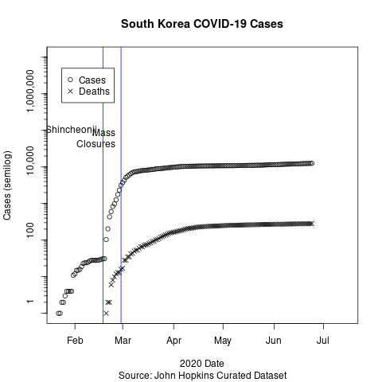

# 2020 Coronavirus Outbreak

Short bit of code to look at cases for China and US on semi-log scale. Why the crazy scale? On a semi-log scale steady exponential growth is a straight line. It's far easier to interpret looking for straight lines to show relativly steady percent growth per day. 

China data was taken from their official NHC website.

The China data shows a clear effect of the quarantine. The estimated slope of the top plateau is shrinking a bit every day. Not shown is that to the left of the graph there is noise similar to the US plot.

US Data comes from John Hopkins. CDC data quality post Trump intervention has become unreliable.

Exponential prediction is based on assumption that nothing occurs to change the current growth rate. This is obviously false, as the China data shows. The question is when will measures be put in place, how effective will they be or are we just going to wait for saturation to happen.

I've been asked for Italy data. They quarantined early and I've put the axis as the same with the US so slopes can easily be compared.

And South Korea is the other hot spot. It appeared to be well contained until a member of the Shincheonji church did not self-quarantine and went to mass gatherings. Later school and social event closures occurred, combined with drive through free testing.
