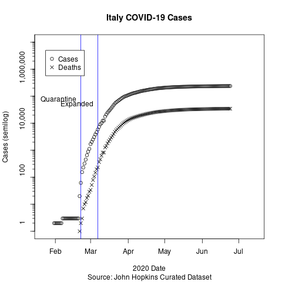
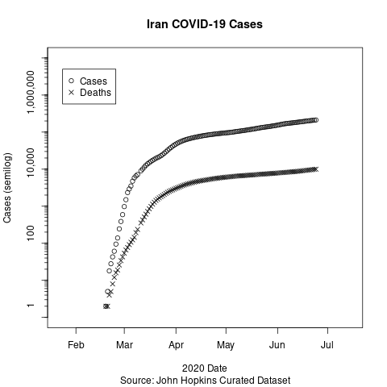
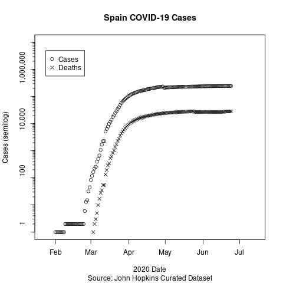
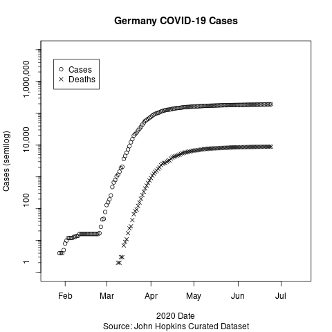
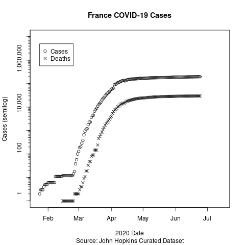

# 2020 Coronavirus Outbreak

Short bit of code to look at cases for China and US on semi-log scale. Why the crazy scale? On a semi-log scale steady exponential growth is a straight line. It's far easier to interpret looking for straight lines to show relativly steady percent growth per day. 

## China

China data was taken from their official NHC website.

The China data shows a clear effect of the quarantine. The estimated slope of the top plateau is shrinking a bit every day. Not shown is that to the left of the graph there is noise similar to the US plot.

## United States

US Data comes from John Hopkins.

Exponential prediction interval is computed based on day 38 to 69. It stops at the first little jump before the travel ban. It appears that after this a new rate is getting establish that is a little slower, but it's still within predicted interval. Doubling time is still approximately 2 days.

Exponential prediction is based on assumption that nothing occurs to change the current growth rate. This is obviously false, as the China data shows. The question is when will measures be put in place, how effective will they be or are we just going to wait for saturation to happen.

The first broad measure has been taken. A Europe travel ban. The graph clearly shows it spreading inside the US. Prediction: It's too late for any such measure to have much effect. It's like getting bedbugs and saying we're no longer going to be visiting hotels to stop them.

### Trump Quotes

* January 22: “We have it totally under control. It’s one person coming in from China. It’s going to be just fine.”
* February 2: “We pretty much shut it down coming in from China.”
* February 24: “The Coronavirus is very much under control in the USA… Stock Market starting to look very good to me!”
* February 25: “CDC and my Administration are doing a GREAT job of handling Coronavirus.”
* February 25: “I think that's a problem that’s going to go away… They have studied it. They know very much. In fact, we’re very close to a vaccine.”
* February 26: “The 15 (cases in the US) within a couple of days is going to be down to close to zero.”
* February 26: “We're going very substantially down, not up.”
* February 27: “One day it’s like a miracle, it will disappear.”
* February 28: “We're ordering a lot of supplies. We're ordering a lot of, uh, elements that frankly we wouldn't be ordering unless it was something like this. But we're ordering a lot of different elements of medical.”
* March 2: “You take a solid flu vaccine, you don't think that could have an impact, or much of an impact, on corona?”
* March 2: “A lot of things are happening, a lot of very exciting things are happening and they’re happening very rapidly.” 
* March 4: “If we have thousands or hundreds of thousands of people that get better just by, you know, sitting around and even going to work — some of them go to work, but they get better.”
* March 5: “I NEVER said people that are feeling sick should go to work.”
* March 5: “The United States… has, as of now, only 129 cases… and 11 deaths. We are working very hard to keep these numbers as low as possible!”
* March 5: “The Obama administration made a decision on testing that turned out to be very detrimental to what we're doing & we undid that decision a few days ago so that testing can take place in a much more accurate & rapid fashion”
* March 6: “I think we’re doing a really good job in this country at keeping it down… a tremendous job at keeping it down.” 
* March 6: “Anybody right now, and yesterday, anybody that needs a test gets a test. They’re there. And the tests are beautiful…. the tests are all perfect like the letter was perfect. The transcription was perfect. Right? This was not as perfect as that but pretty good.”
* March 6: “I like this stuff. I really get it. People are surprised that I understand it… Every one of these doctors said, ‘How do you know so much about this?’ Maybe I have a natural ability. Maybe I should have done that instead of running for president.”
* March 6: “I don't need to have the numbers double because of one ship that wasn't our fault.”
* March 8: “We have a perfectly coordinated and fine tuned plan at the White House for our attack on CoronaVirus.”
* March 9: “This blindsided the world.”
* March 11: “To keep new cases from entering our shores, we will be suspending all travel from Europe to the United States for the next 30 days. The new rules will go into effect Friday at midnight. These restrictions will be adjusted subject to conditions on the ground. There will be exemptions for Americans who have undergone appropriate screenings, and these prohibitions will not only apply to the tremendous amount of trade and cargo, but various other things as we get approval.  Anything coming from Europe to the United States is what we are discussing. These restrictions will also not apply to the United Kingdom.”
* March 11: “... very important for all countries & businesses to know that trade will in no way be affected by the 30-day restriction on travel from Europe. The restriction stops people not goods.”
* March 13 “I am hereby declaring a federal emergency. Two very big words. ... No I don't take responsibility at all. ... Sometimes pandemic response teams just get let go.”
* March 18 “People are dying that never died before.“
* March 18 “I always treated the Chinese Virus very seriously, and have done a very good job from the beginning, including my very early decision to close the “borders” from China - against the wishes of almost all. Many lives were saved. The Fake News new narrative is disgraceful & false!“
* March 20 When asked “What do you say to Americans who are watching right now who are scared?“, Trump responded “I say that you're a terrible reporter, that's what I say.“

## Italy

I've been asked for Italy data. They quarantined early and I've put the axis as the same with the US so slopes can easily be compared. The break in the slope at day 60 (2/29) is consistent with incubation times post exposure being around 5 days.

## South Korea

And South Korea is the other hot spot. It appeared to be well contained until a member of the Shincheonji church did not self-quarantine and went to mass gatherings. Later school and social event closures occurred, combined with drive through free testing, and fever isolation from families. Special hotels for isolation at the moment of case detection are provided.

## Conclusions

One thing that is clear from these plots is the quarantine and other social distancing measures are effective in slowing the growth. Given the nature of exponential growth, it is desirable to put these measure in as early as possible rather than later. 

## More Countries

Note the growth rates are very similar

